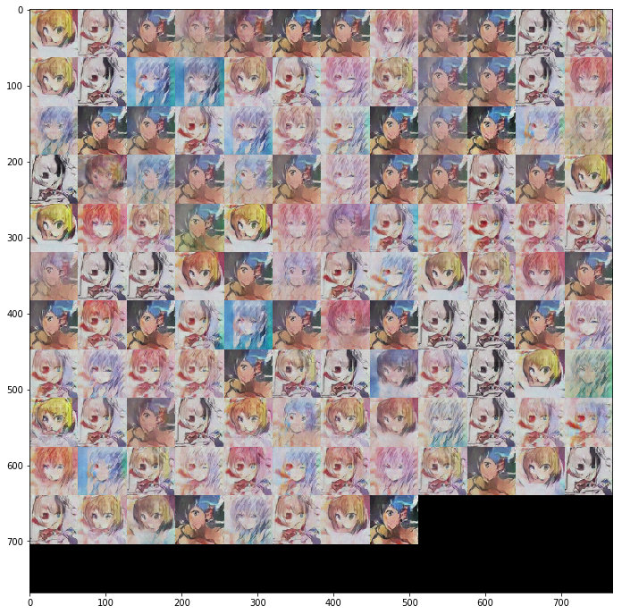

# GAN_MXNET

This tutorial is the implementation of animeGAN in MXNET from https://github.com/jayleicn/animeGAN

To run the code:

    1.Download the rec data from google drive
        https://drive.google.com/drive/u/0/folders/1cl-lmAaKgN2Y6GoYER8J34BlbS4cDviM
        
        The detail code to generate .rec can be found in ./data/
    
    2. run the command under the root "python run_train"
    
        The generated images at epoch 124 are like:

Useful links:
    
https://github.com/jayleicn/animeGAN

https://github.com/apache/incubator-mxnet/tree/master/example/gan
    
https://github.com/ChuckTan123/ganhacks
    
https://github.com/carpedm20/DCGAN-tensorflow

https://arxiv.org/abs/1511.06434

Learn GAN:
The review paper in 2017: https://arxiv.org/pdf/1711.05914.pdf
